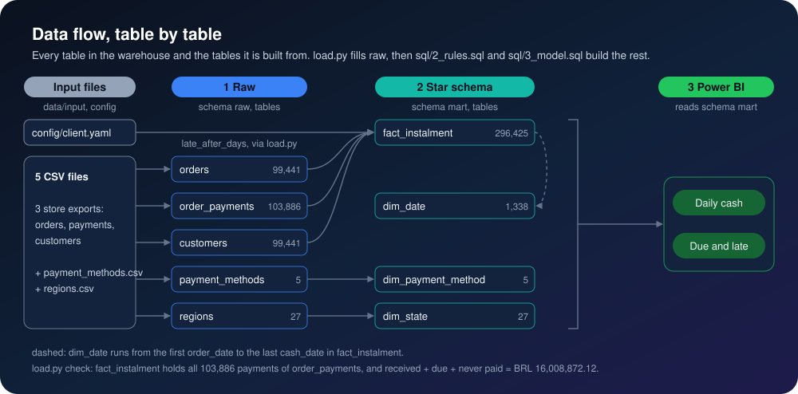
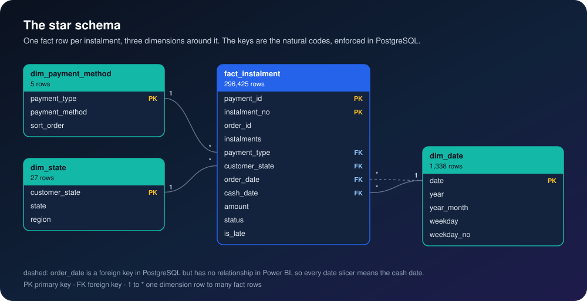
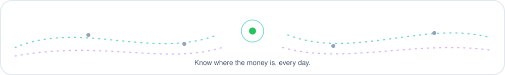

<p align="center">
  
</p>

<p align="center">
  
</p>

<p align="center">
  
  
  
  
  
</p>

> 📖 **New to data?** [The project explained, from zero](docs/explained.md): every word, every number and the interview questions, in plain words.

## The problem

The owner learns how much cash came in only at month end, from a spreadsheet nobody trusts. Card payments arrive in instalments over many months, boleto payments arrive when the customer gets round to paying, and nobody can say on a given day what has come in, what is still owed, or which payments are late.

## 🛠️ The solution

A small warehouse in PostgreSQL, built in six layers from left to right, that turns every order and payment into one row per instalment, with the cash rules written once in SQL, and a Power BI report on top of it: a daily cash page and a due-and-late page. One command loads it and proves that every total still matches the source. Each layer reads only the layer before it, so a number can be traced back to the file and row it came from.

<p align="center">
  
</p>

### 🔁 The mental model: where the money goes

Every payment flows from how it was paid to where it stands on the report date. Card instalments are what push money into the months ahead.

<p align="center">
  
</p>

### 📏 The rules, written once

All four live in the Gold layer, [`sql/3_gold.sql`](sql/3_gold.sql). The notebook and every Power BI measure read them; nothing redefines them.

1. **Cash date.** The source records how many instalments a card payment has, but not when each one is paid. So this is an assumption, not data: instalment 1 is counted on the day the payment was confirmed, instalment *k* is counted *k* − 1 months later. Boleto, debit card and voucher are one instalment.
2. **Report date.** The last day any payment was confirmed: 3 Sep 2018. Instalments on or before it are *received*; later ones are *still due*.
3. **Late.** A payment confirmed more than 3 days after the order was placed (`rules.late_after_days` in [`config/client.yaml`](config/client.yaml)).
4. **Never paid.** An order whose payment was never confirmed.

The instalments of a payment add up to its value to the cent (the first ones are cut to the cent, the last takes the remainder), so the model can be reconciled exactly.

## 📈 The result

<p align="center">
  
</p>

**103,886 payments: 76% of the cash in arrived by credit card, and BRL 1.56 million was still due on instalments.**

| Question | Answer |
|---|---|
| How much was paid? | BRL 16,008,872.12 across 103,886 payments, matching the source to the cent |
| How much came in? | BRL 14,415,391.61 (90.0%) by the report date |
| How much is still due? | BRL 1,556,350.74 (9.7%) on 11,648 card payments, the last instalment in May 2020 |
| How does it arrive? | Credit card 76.1% of the cash in, boleto 19.9%, voucher 2.5%, debit card 1.5% |
| From where? | The Southeast brings in 64.8%; the South 14.5%, the Northeast 11.7% |
| What is late? | 2,301 payments (2.2% of those confirmed), BRL 353,690.84; 78% of them are boleto, and 9.1% of boleto payments are late against 0.6% of card payments |
| What was never paid? | BRL 37,129.77 on 175 payments |


Every number above is computed in [`analysis/analysis.ipynb`](analysis/analysis.ipynb), saved with its outputs, and checked with SQL in [`powerbi/06-checks.md`](powerbi/06-checks.md).

## 📊 The Power BI report

Two pages on the Semantic layer, the star schema: **Daily cash** (cash in by day, payment method and region, with payments confirmed and the late rate for any date range) and **Due and late** (instalments still due by month, money never paid, and every late payment listed).

The report is built step by step from [`powerbi/`](powerbi/): every Power Query step, the model, every DAX measure, each visual with its fields, the theme, and the numbers each card must show.

## 🏗️ How it is built

Every table, the tables it is built from, and its row count after one run:



The Semantic layer, the star schema the report reads:



- **Bronze layer** ([`load.py`](load.py)): the five input files in [`data/input/`](data/input/README.md) (orders, payments, customers, and the payment-method and region mapping files) are checked for their columns, then go into schema `bronze` as text, exactly as written, with the file, the row number, the run id and the load time. A row with an empty required value or a value that would not convert goes to `bronze.quarantine` with the reason (0 rows in this data); a missing file or column, an empty file or a key that appears twice stops the load. Every load is logged in `ops.load_log`. Every client value (names, currency, the late threshold, the calendar, colours, file names) comes from [`config/client.yaml`](config/client.yaml) through [`config.py`](config.py).
- **Silver layer** ([`sql/2_silver.sql`](sql/2_silver.sql)): the same rows typed and keyed; `load.py` stops if a Silver table holds fewer rows than its Bronze table.
- **Gold layer** ([`sql/3_gold.sql`](sql/3_gold.sql)): the cash rules, `gold.instalment`: one row per instalment, with its cash date, amount, status (Received, Due or Never paid) and late flag.
- **Semantic layer** ([`sql/4_semantic.sql`](sql/4_semantic.sql)): the star schema, `semantic.fact_instalment` (296,425 rows) from Gold, with `dim_date` (every day of the fixed range `calendar.start` to `calendar.end` in `config/client.yaml`, 2016 to 2020), `dim_payment_method` and `dim_state` (state and region) from Silver. No dimension is built from the fact. The keys are the natural codes, enforced with primary and foreign keys, so a fact row that points at a missing day, method or state fails the load.
- **Analytical layer** ([`sql/5_analytical.sql`](sql/5_analytical.sql)): three views over the Semantic layer, cash by payment method, by region and by month, that the notebook and [`powerbi/06-checks.md`](powerbi/06-checks.md) read.
- **Reporting layer**: [`analysis/analysis.ipynb`](analysis/analysis.ipynb) reads the Semantic and Analytical layers with pandas, re-reads the payments file without the database for an independent total, and draws the charts; the Power BI report in [`powerbi/`](powerbi/) imports the four Semantic tables.
- **Check:** `load.py` ends by proving that the Semantic layer holds all 103,886 payments loaded into Bronze and that received + still due + never paid equals their total to the cent; it stops with an error if not. The whole run is one transaction, so a failed run changes nothing.

## ▶️ Run it

<p align="center">
  
</p>

You need Docker, Python 3.10 or later, and the three shop files (see Data); the two mapping files are already in `data/input/`.

```bash
cp .env.example .env
docker compose up -d
pip install -r requirements.txt
python load.py
python theme.py
python -m nbconvert --to notebook --execute --inplace analysis/analysis.ipynb
```

`load.py` rebuilds every layer from scratch each time and ends with `check passed`. The database listens on port 5434 (database and user `cash`; the password is in `.env`). `theme.py` writes the Power BI theme from the colours in `config/client.yaml`.

## ⚠️ Limits

The instalment schedule is a stated assumption (rule 1), so "cash by day" for card payments after instalment 1 is modelled, not observed. "Late" only sees the gap between order and payment confirmation; the source has no due dates for individual instalments, so a missed instalment cannot be seen. Amounts are what customers paid, freight included.

## 🗂️ Data

[Brazilian E-Commerce Public Dataset by Olist](https://www.kaggle.com/datasets/olistbr/brazilian-ecommerce) on Kaggle (CC BY-NC-SA 4.0): about 100,000 orders placed from 2016 to 2018, with payments by method and number of instalments, and customers by state. This project uses three of its files. Download them from Kaggle and put them in `data/input/` (they are not committed):

- `olist_orders_dataset.csv`
- `olist_order_payments_dataset.csv`
- `olist_customers_dataset.csv`

The state list in [`data/input/regions.csv`](data/input/regions.csv) derives from the [Olist dataset](https://www.kaggle.com/datasets/olistbr/brazilian-ecommerce) (CC BY-NC-SA 4.0); a client's private copy replaces it with their own mapping.

---

Built by [Omar Shalaby](https://github.com/omarshalabyy1) · PostgreSQL, SQL, Python, Power BI, DAX, Power Query

<p align="center">
  
</p>
